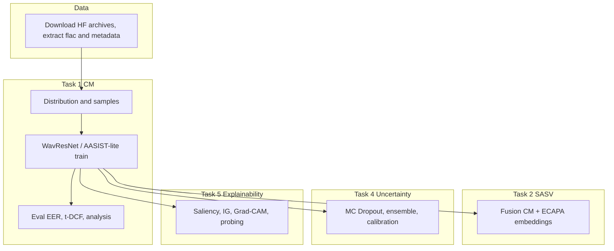

# audio-deepfakes-airi

Countermeasure, SASV, uncertainty estimation, and interpretability for audio deepfake detection on ASVspoof-style data.

## Overview

Binary countermeasure model discriminates bona fide vs spoof speech. SASV extends the setting to target, nontarget, and spoof trials. Uncertainty methods include MC Dropout, deep ensemble, temperature scaling, evidential learning, and entropy. Interpretability covers saliency, Integrated Gradients, Grad-CAM, occlusion, and layer probing.

Dataset: [pymlex/audio-deepfakes-airi](https://huggingface.co/datasets/pymlex/audio-deepfakes-airi) with `flac_T.zip`, `last_eval.zip`, `metadata.zip`.

## Project tree

```
audio-deepfakes-airi/
├── install.py
├── main.py
├── config.py
├── schemas.py
├── requirements.txt
├── .env.example
├── models/
│   └── cm_models.py
├── data/
│   ├── dataset.py
│   └── augmentations.py
├── utils/
│   ├── metrics.py
│   ├── data.py
│   └── training.py
├── task1/
│   ├── configs/
│   ├── 1_1_distribution.py
│   ├── 1_2_audio_samples.py
│   ├── 2_2_loss_compare.py
│   ├── 4_2_main.py
│   ├── 5_1_sota.py
│   ├── 5_2_tricks.py
│   ├── 6_1_analysis.py
│   ├── 6_2_cross_eval.py
│   ├── report.md
│   └── outputs/
├── task2/
│   ├── 2_main.py
│   ├── report.md
│   └── outputs/
├── task4/
│   ├── 4_main.py
│   ├── report.md
│   └── outputs/
├── task5/
│   ├── 5_main.py
│   ├── report.md
│   └── outputs/
└── scripts/
    ├── setup_data.py
    ├── run_task1.py
    ├── upload_hf.py
    └── publish.py
```

## Pipeline



## Setup

One-command install after clone on Ubuntu Jupyter with RTX GPU:

```bash
git clone https://github.com/pymlex/audio-deepfakes-airi.git
cd audio-deepfakes-airi
cp .env.example .env
python install.py
```

Set `HF_TOKEN` in `.env` for dataset and model upload.

## Run

Full pipeline:

```bash
python main.py --task all
```

Individual tasks:

```bash
python main.py --task 1
python main.py --task 2
python main.py --task 4
python main.py --task 5
```

Task 1 only:

```bash
python scripts/run_task1.py --step train --config task1/configs/cm_baseline.yaml
python scripts/run_task1.py --step sota
```

## Models

**WavResNet** — mel-spectrogram, dB scale, ResNet-18 backbone, 2-class CE loss.

**AASISTLite** — CNN encoder, temporal and frequency graph attention, fusion classifier.

**SASVFusionModel** — ECAPA-style embeddings, CM scores, MLP fusion for accept/reject.

## Metrics

CM: EER, min t-DCF, balanced accuracy, ROC-AUC, per-class accuracy.

SASV: a-DCF, SASV-EER, target accept rate, spoof reject rate.

## Publish

| Target | Repository |
|--------|------------|
| Code, metrics, plots, reports | [github.com/pymlex/audio-deepfakes-airi](https://github.com/pymlex/audio-deepfakes-airi) |
| Dataset archives | [pymlex/audio-deepfakes-airi](https://huggingface.co/datasets/pymlex/audio-deepfakes-airi) |
| Model checkpoints | [pymlex/audio-deepfakes-airi](https://huggingface.co/pymlex/audio-deepfakes-airi) |

```bash
python scripts/publish.py
python scripts/upload_hf.py
```

## Citation

```bibtex
@misc{zyukov2026_audio_deepfakes_airi,
  author       = {Alex Zyukov},
  title        = {audio-deepfakes-airi: Countermeasure, SASV, Uncertainty, and Explainability},
  year         = {2026},
  publisher    = {GitHub},
  howpublished = {\url{https://github.com/pymlex/audio-deepfakes-airi}}
}
```

```bibtex
@article{wang2024asvspoof5,
  title   = {ASVspoof 5: Crowdsourced Speech Data, Deepfakes, and Adversarial Attacks at Scale},
  author  = {Wang, Xin and others},
  journal = {arXiv preprint arXiv:2408.08739},
  year    = {2024}
}
```

```bibtex
@article{jung2022sasv,
  title   = {SASV 2022: The First Spoofing-Aware Speaker Verification Challenge},
  author  = {Jung, Jee-weon and others},
  journal = {arXiv preprint arXiv:2203.14732},
  year    = {2022}
}
```

```bibtex
@article{sensoyan2018evidential,
  title   = {Evidential Deep Learning to Quantify Classification Uncertainty},
  author  = {Sensoyan, Murat and others},
  journal = {arXiv preprint arXiv:1806.01768},
  year    = {2018}
}
```

The project is under GPL-3.0 license.
