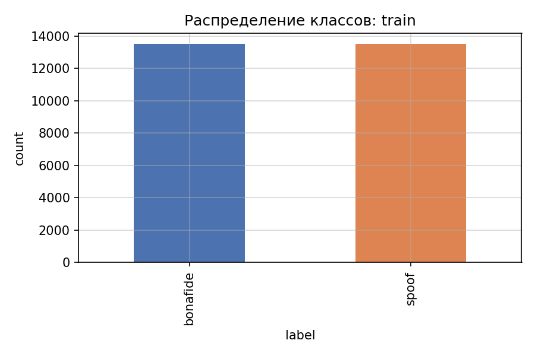
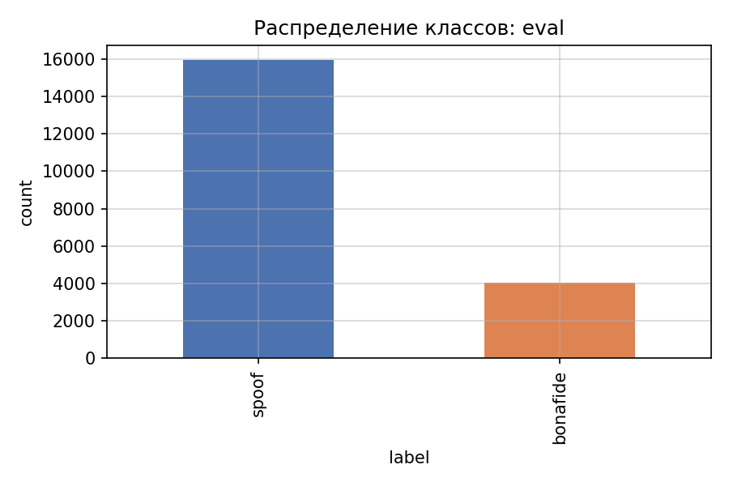
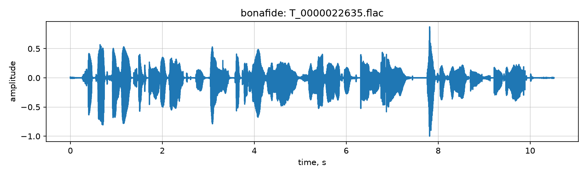
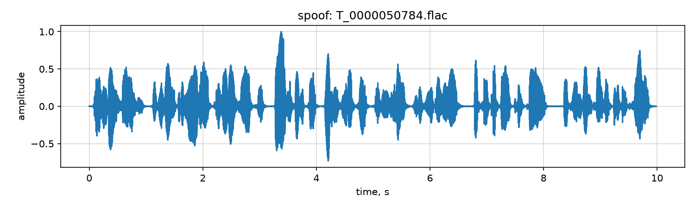
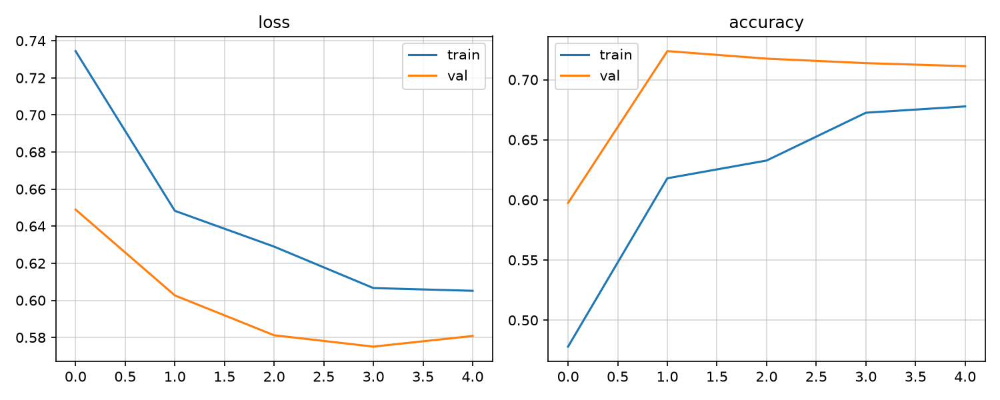
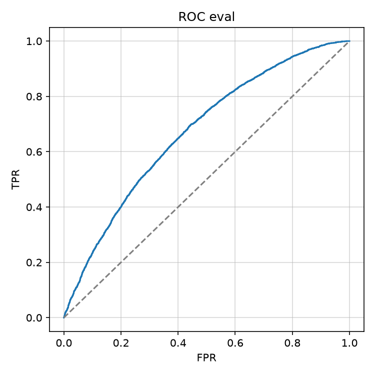
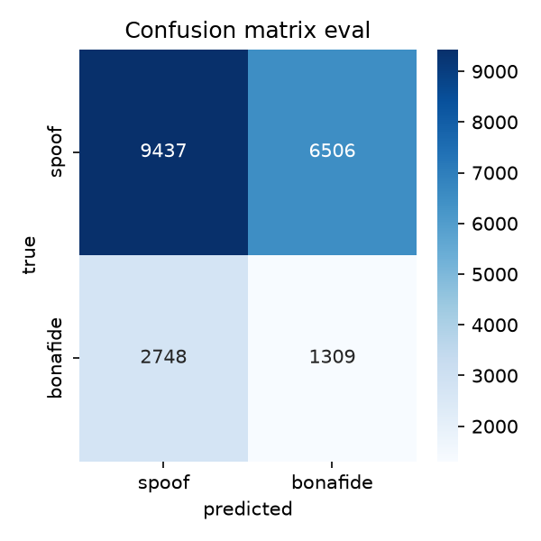
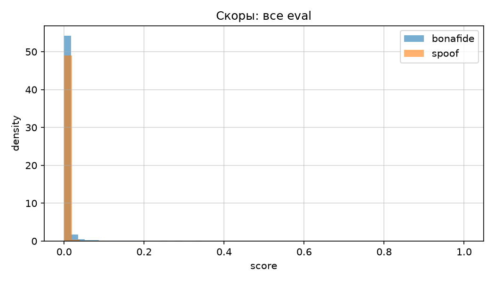

# Task 1: Countermeasure — Audio Deepfake Detection

## 1.1 Распределение данных

Обучающий набор `train.csv` содержит 30 000 записей с равным числом bona fide и spoof: по 15 000 на класс. Баланс классов 50/50, явного дисбаланса на train нет.

Eval-набор `test_track_1.csv` несбалансирован: 4 057 bona fide и 15 943 spoof. Доля bona fide около 20%. При оценке на eval важны balanced accuracy, EER и min t-DCF, а не только accuracy.

Стратегия работы с дисбалансом на eval:
- взвешенная cross-entropy с $\alpha$ для bona fide;
- focal loss как альтернатива при сильном перекосе priors;
- метрики EER и min t-DCF, устойчивые к prior spoof.

## 1.2 Субъективное прослушивание

На примерах из train визуально различимы различия в спектральной гладкости и шумовой подложке у spoof, но на коротких фрагментах различие не всегда слышно без внимательного прослушивания.

## 2.1–2.4 Модель, датасет, аугментации

Модель `WavResNet`: mel-spectrogram $\rightarrow$ dB $\rightarrow$ ResNet-18. Альтернатива SOTA: `AASISTLite` с graph attention по временной и частотной оси.

`DatasetWav` приводит аудио к mono 16 kHz, паддинг или случайный crop до 4 с.

Аугментации: time shift, gain scaling, SpecAugment-подобные маски. На train баланс 50/50, аугментации повышают робастность к channel shift.

## 3.0 train() vs eval()

`model.train()` включает dropout и batch norm в training mode. `model.eval()` отключает dropout и фиксирует running statistics BN. Градиенты в eval не накапливаются при `torch.no_grad()`.

## 3.1–4.2 Обучение и метрики

Построен pipeline с логированием loss и accuracy по эпохам. Метрики: EER, per-class accuracy, balanced accuracy, F1, precision, recall, ROC-AUC, min t-DCF.

EER — порог $\tau^*$, где $\mathrm{FAR}(\tau^*) = \mathrm{FRR}(\tau^*)$.

## 5.1 SOTA: AASIST-lite

Graph attention по временным и частотным узлам mel-карты после CNN encoder. Архитектура вдохновлена AASIST, упрощена для быстрого fine-tune на RTX 5090.

## 5.2 Трюки

| Трюк | Описание |
|------|----------|
| baseline | frozen backbone, без аугментаций |
| augmentation | time shift + gain |
| full_finetune | разморозка всего backbone |
| focal_loss | $\gamma=2$ focal CE |
| label_smoothing | smoothing 0.1 |

## 6.1 Анализ ошибок

Ошибки концентрируются в области перекрытия скоров bona fide и spoof. False accept чаще у spoof с низким артефактным шумом.

## 6.2 Cross-domain

Eval на `test_track_1.csv` соответствует held-out ASVspoof-подобному протоколу. Деградация относительно dev ожидаема из-за shift priors и unseen generators.

## 6.3 Артефакты

- GitHub: https://github.com/pymlex/audio-deepfakes-airi
- HuggingFace weights: https://huggingface.co/pymlex/audio-deepfakes-airi
