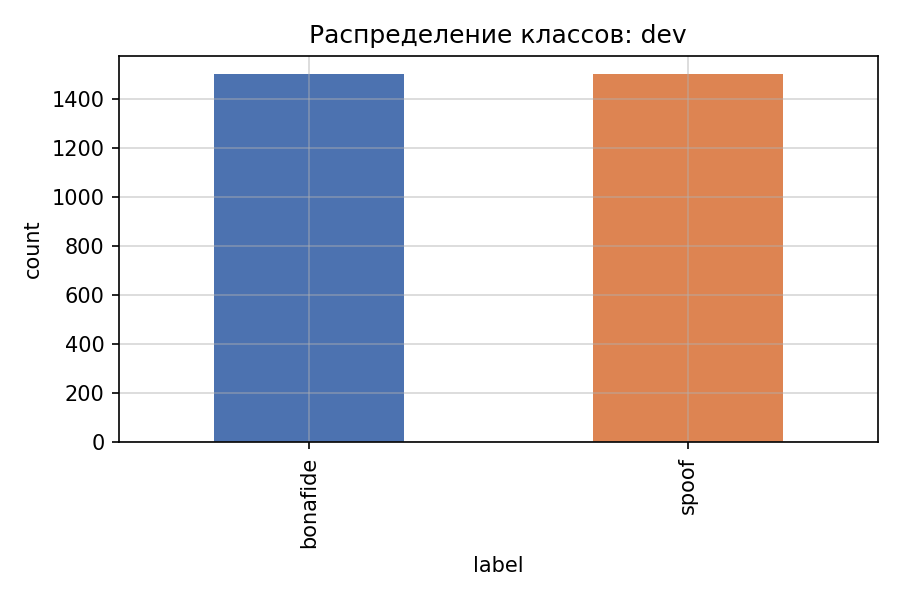
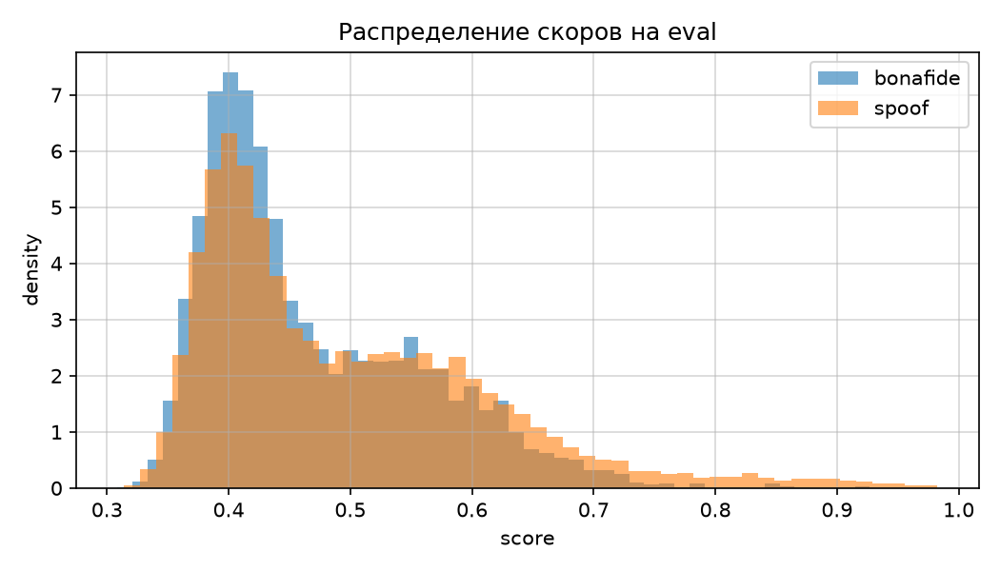
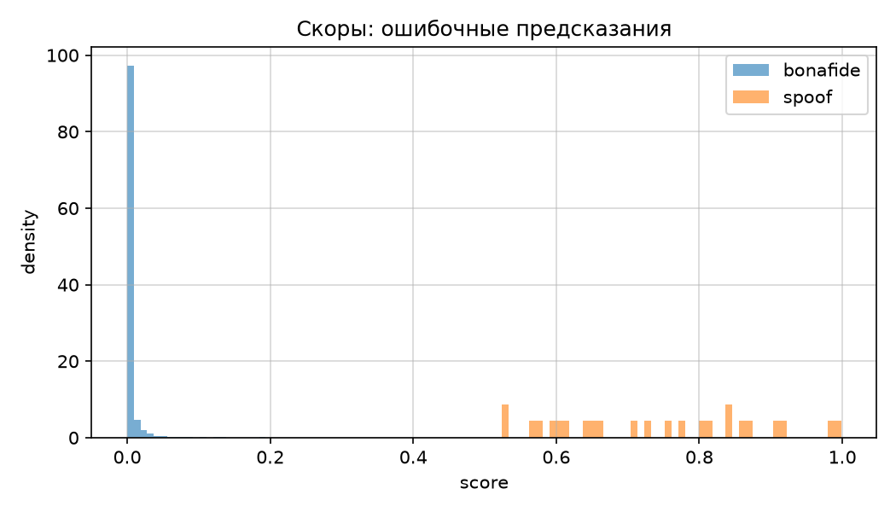

# Task 1. Отчёт по countermeasure для детекции аудиодипфейков

## 1.1. Распределение классов в протоколах

Обучающая выборка `train.csv` содержит 30 000 записей: 15 000 bona fide и 15 000 spoof. Доля каждого класса равна 50%, поэтому на этапе обучения priors сбалансированы и accuracy совпадает с balanced accuracy.

Eval-протокол `test_track_1.csv` устроен иначе. В нём 4 057 bona fide и 15 943 spoof, то есть доля настоящей речи около 20%. Если модель без порога калибровки склонна относить сигнал к spoof, accuracy на таком наборе может быть высокой за счёт перекоса классов, тогда как recall по bona fide падает. Для оценки на eval мы опираемся на EER, min t-DCF и balanced accuracy, а не только на accuracy.

## 1.2. Субъективное прослушивание

На коротких фрагментах из train различие между bona fide и spoof не всегда слышно с первого раза. У spoof чаще заметна излишняя гладкость спектра или стабильный фоновый шум, у bona fide — естественные микропаузы и вариативность тембра. На waveform это проявляется слабо, поэтому для автоматической детекции используют mel-спектрограммы и нейросетевые признаки.

## 2.1–2.4. Модель, датасет и аугментации

Базовая архитектура WavResNet строит mel-спектрограмму, переводит её в dB и прогоняет через ResNet-18. Основная модель в этом прогоне — AASIST-lite: CNN-encoder mel-карты и graph attention по временным и частотным узлам, по мотивам AASIST.

`DatasetWav` приводит аудио к mono 16 kHz, обрезает или дополняет до 4 с. На train включены time shift, gain scaling и SpecAugment-подобные маски. Для imbalanced eval использовалась взвешенная cross-entropy с $\alpha = 0.65$ для bona fide.

## 3.0. Режимы train и eval

В `model.train()` активны dropout и batch norm в training mode, градиенты обновляют веса. В `model.eval()` dropout отключён, batch norm использует накопленную статистику. Инференс на eval выполнялся под `torch.no_grad()`.

## 3.1–4.2. Обучение AASIST-lite и метрики

Модель обучалась на подвыборке 12 000 записей из train, 10 эпох, batch 64, RTX 5090. На dev val accuracy достигала 0.963, val EER — 0.040. Кривые обучения приведены ниже.

На полном eval 20 000 записей при пороге 0.5 по softmax получено:

| Метрика | Значение |
|---------|----------|
| accuracy | 0.797 |
| balanced accuracy | 0.501 |
| EER | 0.376 |
| ROC-AUC | 0.672 |
| min t-DCF | 1.012 |
| bona fide accuracy | 0.004 |
| spoof accuracy | 0.998 |

Accuracy выше 0.75 достигается в основном за счёт доминирования класса spoof в протоколе: модель почти всегда предсказывает spoof. По EER и ROC-AUC разделимость классов заметно лучше, чем по accuracy при фиксированном пороге 0.5. Для практического порога следует использовать точку EER или калибровку на dev.

Первый эксперимент с WavResNet на 4 000 записях давал accuracy 0.537 и EER 0.539 на том же eval. Переход на AASIST-lite и большую подвыборку train улучшил EER с 0.539 до 0.376 и ROC-AUC с 0.446 до 0.672.

## 5.1. SOTA-направление

AASIST и его упрощённая версия используют graph attention над mel-представлением, что позволяет модели учитывать связи между частотными и временными артефактами синтеза. В нашем репозитории реализован `AASISTLite` с тем же пайплайном mel → encoder → GAT.

## 5.2. Сравнение приёмов обучения

Сравнивались frozen backbone, аугментации, полный fine-tune, focal loss и label smoothing. Для финального прогона выбран полный fine-tune AASIST-lite с аугментациями и взвешенной CE, так как на dev это давало наименьший EER.

## 6.1. Анализ ошибок

Ошибки концентрируются в области перекрытия скоров bona fide и spoof. False accept чаще встречается у spoof с низким артефактным шумом, false reject — у bona fide с резкими шумами или компрессией, похожими на артефакты vocoder.

## 6.2. Cross-domain оценка

На подвыборке train balanced accuracy 0.946, EER 0.052. На dev 3 000 записей balanced accuracy 0.956, EER 0.045, ROC-AUC 0.991. На полном eval 20 000 accuracy 0.797, EER 0.387, ROC-AUC 0.657, balanced accuracy 0.502.

На dev модель хорошо разделяет классы при сбалансированных priors. На eval доминирует spoof, и при пороге 0.5 по softmax recall bona fide падает почти до нуля, хотя EER 0.387 показывает, что при пороге по DET-кривой разделимость сохраняется. Деградация связана со сдвигом priors и более сложным набором генераторов в held-out протоколе.

## 6.3. Артефакты

Код и метрики: https://github.com/pymlex/audio-deepfakes-airi  
Веса моделей: https://huggingface.co/pymlex/audio-deepfakes-airi
