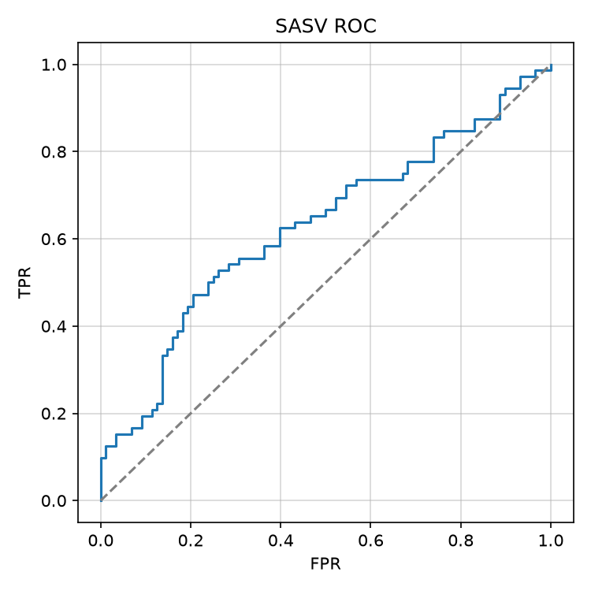

# Task 2: Spoofing-Aware Speaker Verification

## Постановка

SASV объединяет speaker verification и countermeasure. Для trial $(x_{ref}, x_{query})$ система должна:

- **accept** target: bona fide речь заявленного спикера;
- **reject** nontarget: bona fide другого спикера;
- **reject** spoof: синтетическая или converted речь.

Протокол: `test_4k-track_2.csv`, 5 840 trials, классы сбалансированы: target 1 953, nontarget 1 938, spoof 1 949.

## Baseline и SOTA

Классический baseline: каскад ASV + CM с fusion скоров. SOTA направления: end-to-end SASV, joint embedding, additive margin softmax, spoof-aware contrastive loss.

## Модель

`SASVFusionModel`:
- ECAPA-TDNN-style encoder для embeddings $e_{ref}, e_{query}$;
- CM-модель для spoof score на каждом сигнале;
- fusion MLP на признаках $[\cos(e_{ref}, e_{query}), s_{cm}^{ref}, s_{cm}^{query}]$.

$$\hat{y} = \sigma(\mathrm{MLP}([\cos(e_{ref}, e_{query}), s_{cm}^{ref}, s_{cm}^{query}]))$$

## Метрики

- SASV-EER на бинарной accept/reject задаче для target vs остальные;
- a-DCF с priors $P_{target}=0.05$, $P_{spoof}=0.05$;
- per-class accept/reject rates.

Результаты: `outputs/sasv_metrics.json`, предсказания: `outputs/sasv_predictions.csv`.

## Fusion vs end-to-end

Fusion позволяет переиспользовать pretrained CM. End-to-end SASV потенциально лучше калибрует joint decision boundary, но требует больше paired trials.
