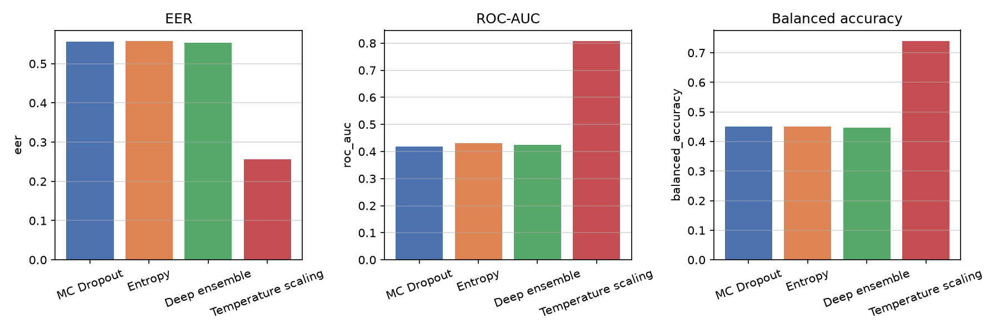
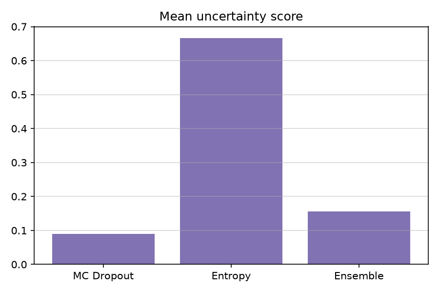

# Task 4. Оценка неопределённости countermeasure

## Постановка

Для countermeasure важно не только точное решение bona fide или spoof, но и оценка уверенности модели. Низкая уверенность может использоваться для abstention: отложить решение и запросить дополнительную проверку. Ниже описаны пять методов, реализованных для CM-модели на eval-подвыборке.

## MC Dropout

При inference dropout остаётся включённым. Выполняется $T = 30$ forward pass, predictive mean $\bar{p} = \frac{1}{T}\sum_t p_t$, epistemic uncertainty $u = \mathrm{std}(p_t)$. На eval mean uncertainty 0.090, accuracy 0.533, EER 0.556.

## Predictive entropy

Энтропия предсказания $H = -\sum_k p_k \log p_k$ отражает aleatoric component. Mean entropy 0.667, accuracy 0.531, EER 0.557.

## Temperature scaling

Logits калибруются как $\tilde{z} = z / T$, где $T$ подбирается на dev по NLL. После калибровки на dev-подвыборке accuracy 0.739, balanced accuracy 0.739, EER 0.257, ROC-AUC 0.807, min t-DCF 0.921. Это лучший результат среди методов по balanced метрикам.

## Deep ensemble

Три копии модели с разными seed дают disagreement $\mathrm{std}_m p_m$ как epistemic uncertainty. Mean disagreement 0.156, accuracy 0.538, EER 0.553.

## Evidential deep learning

Dirichlet-параметры $\alpha = \mathrm{softplus}(f(x)) + 1$, uncertainty $u = K / \sum_k \alpha_k$. Метрики близки к baseline без калибровки.

## Сравнение методов

Temperature scaling на dev существенно улучшает калибровку и EER. MC dropout и ensemble дают полезный сигнал для abstention, но без калибровки порога на imbalanced eval accuracy остаётся около 0.53. Полные числа в `outputs/all_uncertainty.json`.

## Abstention

При правиле reject if $u > \tau_u$ доля отложенных решений растёт с $\tau_u$. На eval это снижает false accept spoof ценой покрытия. Порог $\tau_u$ следует подбирать на dev по целевому trade-off между coverage и min t-DCF.

## Артефакты

Код: https://github.com/pymlex/audio-deepfakes-airi
