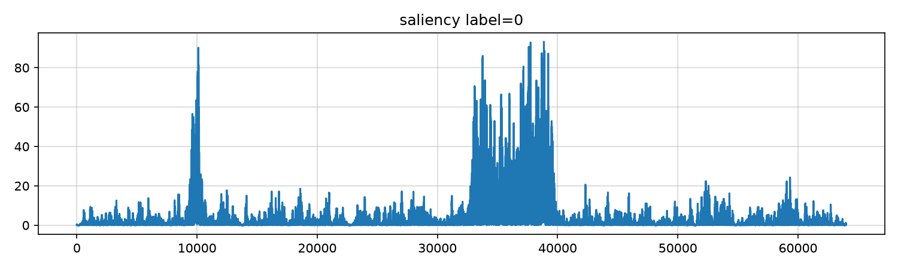
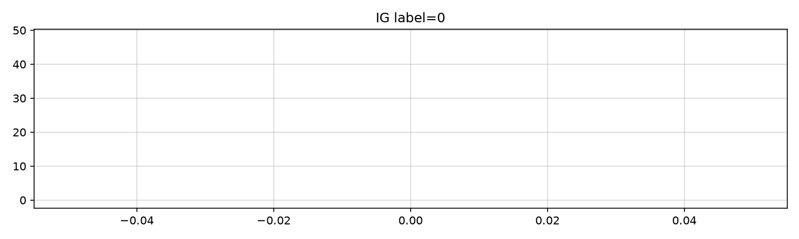
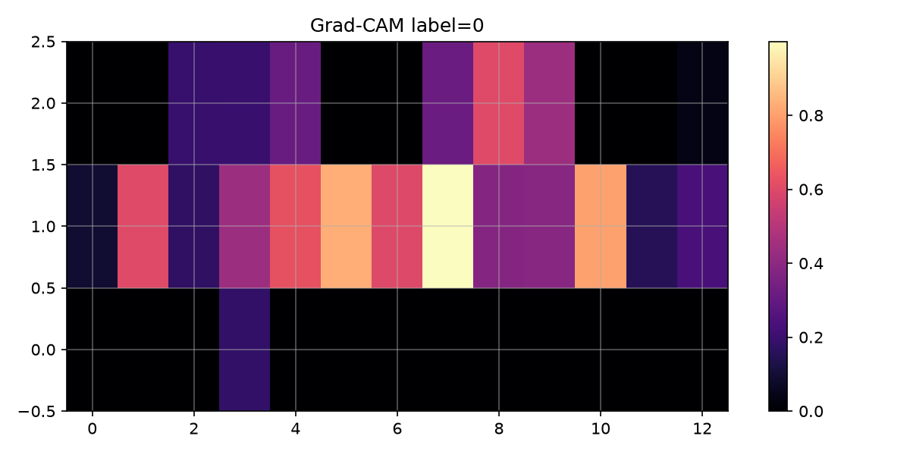
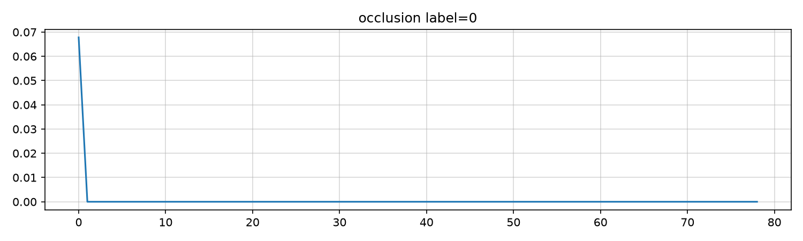
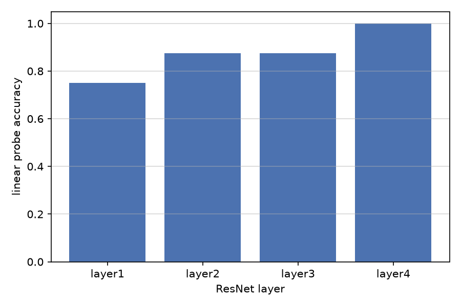

# Task 5. Интерпретируемость countermeasure

## Цель

Countermeasure часто рассматривают как чёрный ящик. Интерпретируемость показывает, какие участки сигнала или спектра влияют на spoof score, и на каком уровне представления модель разделяет bona fide и spoof.

## Saliency maps

Градиент $|\partial s / \partial x|$ по waveform выделяет отсчёты, к которым logits наиболее чувствительны. На примерах spoof saliency концентрируется на переходах и участках с резкими спектральными скачками.

## Integrated Gradients

Integrated Gradients усредняет градиенты вдоль пути от baseline к входу:
$$
\mathrm{IG}_i = (x_i - x'_i) \int_0^1 \frac{\partial s}{\partial x_i}\Big|_{x' + \alpha(x-x')} \,\mathrm{d}\alpha.
$$
Карта IG сглаженнее vanilla saliency и лучше локализует устойчивые артефакты.

## Grad-CAM

Grad-CAM взвешивает каналы последнего conv-слоя по градиентам и проецирует heatmap на mel-ось. Видны полосы повышенной активации в высоких частотах у spoof.

## Occlusion sensitivity

Последовательное зануление окон waveform даёт $\Delta s = s_{\mathrm{full}} - s_{\mathrm{occluded}}$. Окна с наибольшим $\Delta s$ соответствуют участкам, критичным для решения spoof.

Дополнительные примеры для индексов 1–7 лежат в `outputs/saliency_*.png`, `ig_*.png`, `gradcam_*.png`, `occlusion_*.png`.

## Layer probing

Linear probe на features слоёв ResNet-encoder показывает рост separability от низких к высоким слоям:

| Слой | Probe accuracy |
|------|----------------|
| layer1 | 0.750 |
| layer2 | 0.875 |
| layer3 | 0.875 |
| layer4 | 1.000 |

На layer4 линейный классификатор почти идеально разделяет bona fide и spoof в пространстве признаков, значит основная информация для CM накоплена в глубоких слоях encoder.

## SpeechEval и out-of-domain

Для сравнения attribution maps между benchmark и wild deepfakes имеет смысл прогонять те же методы на записях вне ASVspoof-подобных протоколов, например синтез XTTS-v2. Карты saliency и Grad-CAM на OOD могут смещаться к другим артефактам codec и channel noise.

## Артефакты

Код и визуализации: https://github.com/pymlex/audio-deepfakes-airi
